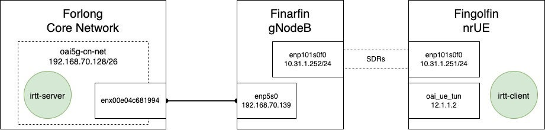

# Bring Up an Standalone 5G Network with Docker Only


We use 3 servers, Forlong as the core network provider, Finarfin as gnodeb and Fingolfin as nrUE.



## A. Core Network

The core network will use `192.168.70.128/26` subnet and interface `enx00e04c681994` on Forlong. Create the network with the name `oai-5gcn-net`:
```
sudo sysctl net.ipv4.conf.all.forwarding=1
sudo iptables -P FORWARD ACCEPT
docker network create --subnet 192.168.70.128/26 --driver macvlan -o parent=enx00e04c681994 oai-5gcn-net
```

Then run the services as below respectively:

### 1. MySQL

name: `5gcn-0-mysql`\
image: `samiemostafavi/expeca-mysql`\
network: `oai-5gcn-net`\
command: 
```
docker run --rm -d --network oai-5gcn-net --ip 192.168.70.131 --name 5gcn-0-mysql samiemostafavi/expeca-mysql
```
	
### 2. NRF

if want to run with nrf

name: `5gcn-1-nrf`\
image: `samiemostafavi/expeca-nrf`\
network: `oai-5gcn-net`\
environment variables: 
```
NRF_INTERFACE_NAME_FOR_SBI=eth0
```
run:
```
docker run --rm -d --network oai-5gcn-net --ip 192.168.70.130 -e NRF_INTERFACE_NAME_FOR_SBI='eth0' --name 5gcn-1-nrf samiemostafavi/expeca-nrf
```
	
### 3. UDR

name: `5gcn-2-udr`\
image: `samiemostafavi/expeca-udr`\
network: `oai-5gcn-net`\
environment variables with `nrf`:
```
UDR_INTERFACE_NAME_FOR_NUDR=net1,USE_FQDN_DNS=no
```
environment variables without `nrf`:
```
UDR_INTERFACE_NAME_FOR_NUDR=eth0,USE_FQDN_DNS=no,REGISTER_NRF=no
```
run: 
```
docker run --rm -d --network oai-5gcn-net --ip 192.168.70.136 -e NRF_INTERFACE_NAME_FOR_SBI='eth0' -e USE_FQDN_DNS='no' -e REGISTER_NRF='no' --name 5gcn-2-udr samiemostafavi/expeca-udr
```
We add `REGISTER_NRF=no` to env variables if don't want to run nrf

### 4. UDM
	
name: `5gcn-3-udm`\
image: `samiemostafavi/expeca-udm`\
network: `oai-5gcn-net`\
environment variables with `nrf`:
```
SBI_IF_NAME=net1,USE_FQDN_DNS=no
```
environment variables without `nrf`:
```
SBI_IF_NAME=net1,USE_FQDN_DNS=no,REGISTER_NRF=no
```
run: 
```
docker run --rm -d --network oai-5gcn-net --ip 192.168.70.137 -e NRF_INTERFACE_NAME_FOR_SBI='eth0' -e USE_FQDN_DNS='no' -e REGISTER_NRF='no' --name 5gcn-3-udm samiemostafavi/expeca-udm
```
We add `REGISTER_NRF=no` to env variables if don't want to run nrf

### 5. AUSF

name: `5gcn-4-ausf`\
image: `samiemostafavi/expeca-ausf`\
network: `oai-5gcn-net`\
environment variables with `nrf`: 
```
SBI_IF_NAME=eth0,USE_FQDN_DNS=no
```
environment variables without `nrf`: 
```
SBI_IF_NAME=eth0,USE_FQDN_DNS=no,REGISTER_NRF=no
```
run: 
```
docker run --rm -d --network oai-5gcn-net --ip 192.168.70.138 -e NRF_INTERFACE_NAME_FOR_SBI='eth0' -e USE_FQDN_DNS='no' -e REGISTER_NRF='no' --name 5gcn-4-ausf samiemostafavi/expeca-ausf
```
We add `REGISTER_NRF=no` to env variables if don't want to run nrf

### 6. AMF

name: `5gcn-5-amf`\
image: `samiemostafavi/expeca-amf`\
network: `oai-5gcn-net`\
environment variables with `nrf`: 
```
AMF_INTERFACE_NAME_FOR_NGAP=eth0,AMF_INTERFACE_NAME_FOR_N11=eth0,USE_FQDN_DNS=no
```
environment variables without `nrf`: 
```
AMF_INTERFACE_NAME_FOR_NGAP=eth0,AMF_INTERFACE_NAME_FOR_N11=eth0,USE_FQDN_DNS=no,NF_REGISTRATION=no,SMF_SELECTION=no
```
run: 
```
docker run --rm -d --network oai-5gcn-net --ip 192.168.70.132 -e AMF_INTERFACE_NAME_FOR_NGAP='eth0' -e AMF_INTERFACE_NAME_FOR_N11='eth0' -e USE_FQDN_DNS='no' -e NF_REGISTRATION='no' -e SMF_SELECTION='no' --name 5gcn-5-amf samiemostafavi/expeca-amf
```
We add `NF_REGISTRATION=no,SMF_SELECTION=no` to env variables if don't want to run nrf

### 7. SMF

name: `5gcn-6-smf`\
image: `samiemostafavi/expeca-smf`\
network: `oai-5gcn-net`\
environment variables with `nrf`: 
```
USE_FQDN_DNS=no,SMF_INTERFACE_NAME_FOR_N4=eth0,SMF_INTERFACE_NAME_FOR_SBI=eth0
```
environment variables without `nrf`: 
```
USE_FQDN_DNS=no,SMF_INTERFACE_NAME_FOR_N4=eth0,SMF_INTERFACE_NAME_FOR_SBI=eth0,REGISTER_NRF=no,DISCOVER_UPF=no
```
run: 
```
docker run --rm -d --network oai-5gcn-net --ip 192.168.70.133 -e USE_FQDN_DNS='no' -e SMF_INTERFACE_NAME_FOR_N4='eth0' -e SMF_INTERFACE_NAME_FOR_SBI='eth0' -e REGISTER_NRF='no' -e DISCOVER_UPF='no' --name 5gcn-6-smf samiemostafavi/expeca-smf
```
We add `REGISTER_NRF=no,DISCOVER_UPF=no` to env variables if don't want to run nrf. Make sure the new `child-entrypoint.sh` runs and adds `oai-spgwu` ip address to `/etc/hosts`.
	
### 8. SPGWU
	
This service is responsible for the 5G egress point. It must be running with more capabalities and permissions compared to the other services:
```
cap_add:
    - NET_ADMIN
    - SYS_ADMIN
cap_drop:
    - ALL
privileged: true
```
Create the container in Openstack with the following parameters

name: `5gcn-7-spgwu`\
image: `samiemostafavi/expeca-spgwu`\
network: `oai-5gcn-net`\
environment variables with `nrf`:
```
SGW_INTERFACE_NAME_FOR_S1U_S12_S4_UP=eth0,SGW_INTERFACE_NAME_FOR_SX=eth0,PGW_INTERFACE_NAME_FOR_SGI=eth0,USE_FQDN_NRF=no
```
environment variables without `nrf`:
```
SGW_INTERFACE_NAME_FOR_S1U_S12_S4_UP=eth0,SGW_INTERFACE_NAME_FOR_SX=eth0,PGW_INTERFACE_NAME_FOR_SGI=eth0,USE_FQDN_NRF=no,REGISTER_NRF=no
```
run:
```
docker run --rm -d --network oai-5gcn-net --ip 192.168.70.134 --privileged -e SGW_INTERFACE_NAME_FOR_S1U_S12_S4_UP='eth0' -e SGW_INTERFACE_NAME_FOR_SX='eth0' -e PGW_INTERFACE_NAME_FOR_SGI='eth0' -e USE_FQDN_NRF='no' -e REGISTER_NRF='no' --name 5gcn-7-spgwu samiemostafavi/expeca-spgwu
```

if running `samiemostafavi/expeca-spgwu-irtt`, run the following command after the main command to run `irtt` server:
```
docker exec -d 5gcn-7-spgwu irtt server
```

We add `REGISTER_NRF=no` to env variables if don't want to run nrf.
	
## B. Radio Access Network
	
### 1. gNodeB
	
Finarfin runs gNodeB with an E320 connected on SFP with ip `10.31.1.2`. Interface `enp5s0` is connected to Forlong (running 5g core network) and should have the static ip `192.168.70.139`.

name: `5g-gnodeb-1`\
image: `samiemostafavi/expeca-oai-gnb`\
env variables:
```
USE_SA_TDD_MONO_E320=yes,GNB_ID=e00,GNB_NAME=gNB-OAI,MCC=001,MNC=01,MNC_LENGTH=2,TAC=1,NSSAI_SST=1,NSSAI_SD=1,AMF_IP_ADDRESS=192.168.70.132,GNB_NGA_IF_NAME=enp5s0,GNB_NGA_IP_ADDRESS=192.168.70.139,GNB_NGU_IF_NAME=enp5s0,GNB_NGU_IP_ADDRESS=192.168.70.139,ATT_TX=0,ATT_RX=0,MAX_RXGAIN=114,SDR_ADDRS=addr=10.31.1.2,THREAD_PARALLEL_CONFIG=PARALLEL_SINGLE_THREAD,USE_ADDITIONAL_OPTIONS=--sa --usrp-tx-thread-config 1 -E --gNBs.[0].min_rxtxtime 6
```
Note: you can try with `--continuous-tx` for better timing stability.

run:
```
docker run --rm --privileged --network host -e USE_SA_TDD_MONO_E320='yes' -e GNB_ID='e00' -e GNB_NAME='gNBOAI' -e MCC='001' -e MNC='01' -e MNC_LENGTH='2' -e TAC='1' -e NSSAI_SST='1' -e NSSAI_SD='1' -e AMF_IP_ADDRESS='192.168.70.132' -e GNB_NGA_IF_NAME='enp5s0' -e GNB_NGA_IP_ADDRESS='192.168.70.139' -e GNB_NGU_IF_NAME='enp5s0' -e GNB_NGU_IP_ADDRESS='192.168.70.139' -e ATT_TX='0' -e ATT_RX='0' -e MAX_RXGAIN='114' -e SDR_ADDRS='addr=10.31.1.2' -e THREAD_PARALLEL_CONFIG='PARALLEL_SINGLE_THREAD' -e USE_ADDITIONAL_OPTIONS='--sa --usrp-tx-thread-config 1 -E --gNBs.[0].min_rxtxtime 6' --name 5g-gnodeb samiemostafavi/expeca-oai-gnb
```
	
### 2. nrUE
	
Fingolfin runs nrUE with an E320 connected on SFP with ip `10.31.1.4`.


name: `5g-nrue-1`\
image: `samiemostafavi/expeca-oai-nr-ue`\
network: `sdr2-net`\
env variables:
```
FULL_IMSI=001010000000001,FULL_KEY=fec86ba6eb707ed08905757b1bb44b8f,OPC=C42449363BBAD02B66D16BC975D77CC1,DNN=oai,NSSAI_SST=1,USE_ADDITIONAL_OPTIONS=-r 106 --numerology 1 --band 78 -C 3619200000 --nokrnmod --sa -E --uicc0.imsi 001010000000001 --uicc0.nssai_sd 1 --usrp-args addr=10.31.1.4 --ue-fo-compensation --ue-rxgain 120 --ue-txgain 0 --ue-max-power 0
```

run:
```
docker run --rm --privileged --network host -e FULL_IMSI='001010000000001' -e FULL_KEY='fec86ba6eb707ed08905757b1bb44b8f' -e OPC='C42449363BBAD02B66D16BC975D77CC1' -e DNN='oai' -e NSSAI_SST='1' -e USE_ADDITIONAL_OPTIONS='-r 106 --numerology 1 --band 78 -C 3619200000 --nokrnmod --sa -E --uicc0.imsi 001010000000001 --uicc0.nssai_sd 1 --usrp-args addr=10.31.1.4 --ue-fo-compensation --ue-rxgain 120 --ue-txgain 0 --ue-max-power 0' --name 5g-nrue samiemostafavi/expeca-oai-nr-ue
```

# References

https://gitlab.eurecom.fr/oai/openairinterface5g/-/blob/develop/doc/NR_SA_CN5G_gNB_USRP_COTS_UE_Tutorial.md
